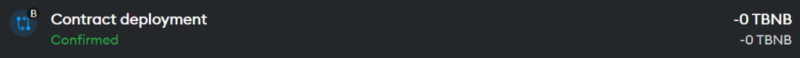
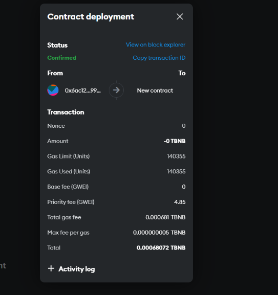

# BlockChain

Proyecto BlockChain para Metamask en BNB Chain

## Tabla de Contenidos

- [Descripción](#descripción)
- [Requerimientos](#requerimientos)
- [Planteamiento](#planteamiento)
- [Despliegue del Contrato](#despliegue-del-contrato)
- [Integración con la Página Web](#integración-con-la-página-web)
- [Transacciones y Funcionamiento](#transacciones-y-funcionamiento)
- [Verificación en MetaMask](#verificación-en-metamask)

---

## Descripción

Este proyecto consiste en el desarrollo de una página web que interactúa con un contrato inteligente desplegado en la BNB Chain TestNet. Permite a los usuarios cambiar el valor de un número a través de transacciones realizadas con MetaMask.

---

## Requerimientos

Para el desarrollo y funcionamiento del proyecto se utilizan las siguientes herramientas:

- **Remix Ethereum IDE**  
  Indispensable para el despliegue del contrato inteligente en Web3.  
  

- **MetaMask**  
  Cartera utilizada para administrar transacciones en la BNB Chain TestNet.  
  

- **NextJS**  
  Framework base para el desarrollo del frontend.  
  

- **Bootstrap**  
  Framework frontend para el diseño y componentes del sitio web.  
  

- **BNB Chain TestNet**  
  Red de pruebas para realizar transacciones y probar el contrato inteligente.  
  

---

## Planteamiento

La idea principal es crear una página web que permita interactuar con un contrato inteligente básico en una red de prueba de MetaMask. El usuario podrá cambiar el valor de un número y visualizar el resultado en pantalla.

---

## Despliegue del Contrato

Para desplegar el contrato en Remix Ethereum y conectarlo con MetaMask:

1. Escribir el código del contrato en Remix.
2. Desplegar el contrato en la BNB Chain TestNet usando MetaMask.

---

## Integración con la Página Web

Una vez desplegado el contrato, se programa el módulo web para importar los datos del contrato y permitir la interacción desde la interfaz.

El diseño utiliza una paleta azul y celeste, implementada con Bootstrap y Next.JS.

---

## Transacciones y Funcionamiento

1. Conectar la cartera MetaMask.
2. Ingresar el número deseado en el input.
3. Realizar la transacción para cambiar el número, aceptando el pago de gas.

---

## Verificación en MetaMask

En MetaMask se pueden visualizar las transacciones realizadas y las comisiones pagadas por el gas.

---

## Notas

- Asegúrese de tener MetaMask configurado en la BNB Chain TestNet.
- El contrato debe estar correctamente desplegado y la página web conectada para realizar las transacciones.